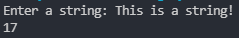

# Input Exercise
## In this exercise, you have to work with the input function.

# Instructions:
### You have to make an ibnput function from which, when entered, gives the length of the string (the number of characters)
### **HINT:** The "len()" function is used to count the number of characters of a string.
### Your code should work with any input provided.
### The output code should look like this:


# Solution
### I recommend you **NOT** to see this before you solve this exercise.
### If you have completed this and got the result as expects **OR** you got stuck somewhere. You can see this!
<details>
    <summary>Click to show the code</summary>

```py
print(len(input('Enter a string: ')))
# The input() function gets the string you input, the len() function gets the length of the string, and then print() function prints the result.
```
</details>