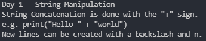

# Debugging Exercise
## In this exercise, you have to debug some code.

# Instructions:
### The output should be `exact`, meaning that all the characters should be same as given. This includes `character(letter) case`, `symbols` and even `spaces`!
### There should not be any errors in the code, and it should give the following output when ran:


# Code:
### You have to fix the given code:
```py
print(Day 1 - String Manipulation")
print("String Concatenation is done with the "+" sign.")
  print('e.g. print("Hello " + "world")')
print(("New lines can be created with a backslash and n.")
```

# Solution
### I recommend you **NOT** to see this before you solve this exercise.
### If you have completed this and got the result as expects **OR** you got stuck somewhere. You can see this!
<details>
    <summary>Click to show the code</summary>

```py
print('Day 1 - String Manipulation')
print('String Concatenation is done with the "+" sign.')
print('e.g. print("Hello " + "world")')
print(("New lines can be created with a backslash and n.")) 
```
</details>